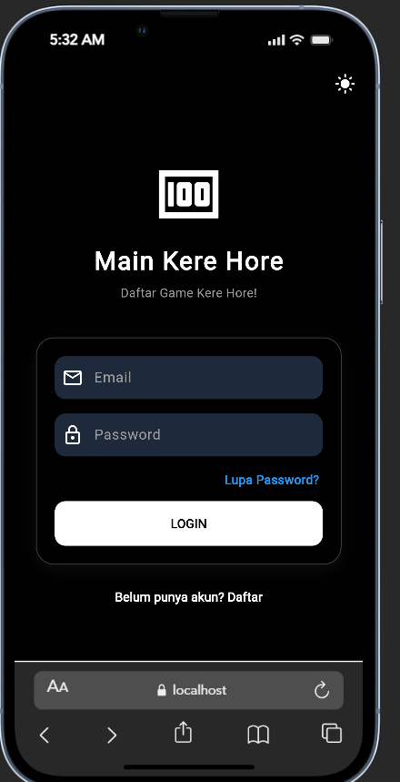
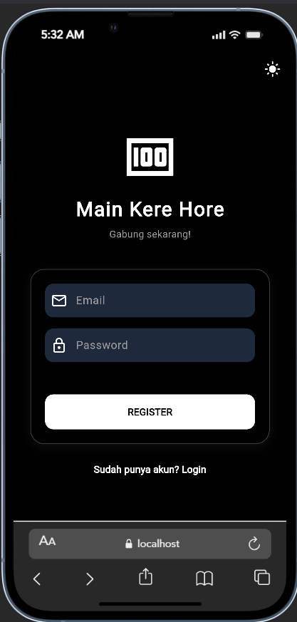
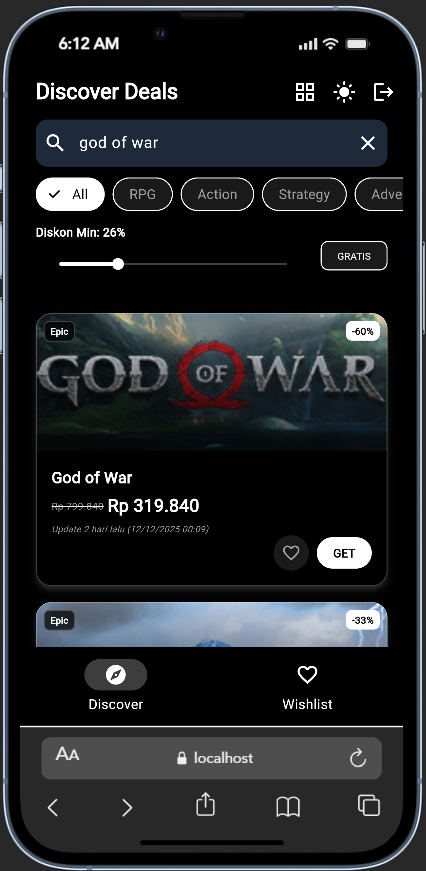
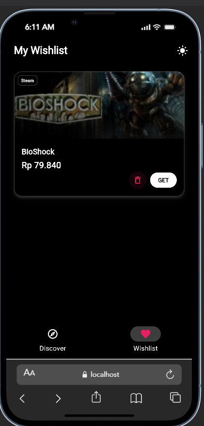
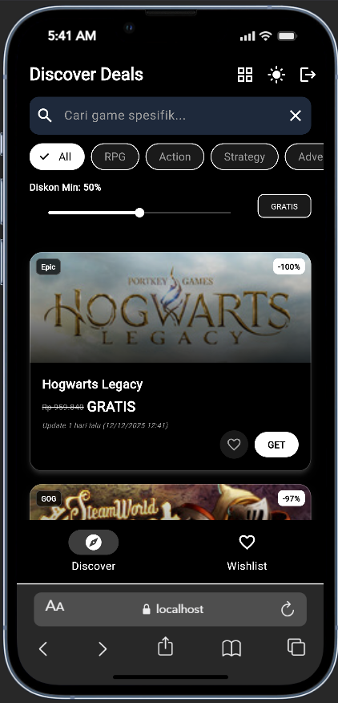
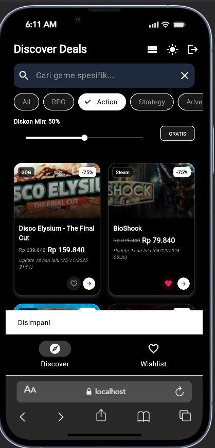

# Main Kere Hore

**Main Kere Hore** merupakan aplikasi mobile berbasis **Flutter** yang membantu pengguna menemukan penawaran diskon game terbaik dari platform resmi seperti **Steam**, **Epic Games**, dan **GOG**. [...]

Aplikasi ini menyediakan **fitur filter lengkap** dan **sinkronisasi wishlist**, sehingga pengguna bisa mengikuti penurunan harga serta penawaran game gratis dengan lebih efisien.
Aplikasi dapat didownload melalui section "release* pada repo ini

---

## Fitur Utama

### **Pencarian Penawaran (Discover Deals)**
Menelusuri penawaran game melalui **API CheapShark**.

### **Filter Lanjutan**
Penyaringan berdasarkan:
- Judul
- Genre (Action, RPG, Strategy, dll.)
- Persentase diskon

### **Mode Game Gratis**
Menampilkan daftar game yang sedang digratiskan.

### **Sinkronisasi Wishlist**
Menyimpan game favorit ke **Supabase**, dengan sinkronisasi otomatis ke semua perangkat.

### **Tema Tampilan**
- Dark Mode (optimal untuk AMOLED)
- Light Mode

### **Fleksibilitas Tampilan**
- **List View** untuk detail lengkap
- **Grid View** untuk tampilan lebih ringkas

### **Autentikasi Pengguna**
Login dan daftar menggunakan verifikasi email melalui **Supabase Auth**.

---

## Teknologi yang Digunakan

- **Frontend:** Flutter (Dart)
- **Backend & Database:** Supabase (PostgreSQL, Auth)
- **Integrasi API:**
  - CheapShark API (diskon)
  - Steam Store API (validasi genre)
- **Manajemen State:** `setState`, `ValueNotifier`
- **Konektivitas:** `http` package

---

## Struktur Folder

Berikut struktur folder utama pada proyek ini dan penjelasan singkat tiap bagian:

- android/ - Proyek Android yang dihasilkan oleh Flutter (konfigurasi native Android).
- ios/ - Proyek iOS yang dihasilkan oleh Flutter (konfigurasi native iOS, Assets.xcassets, dll.).
- lib/ - Kode sumber Flutter (Dart). Di sinilah UI, logika aplikasi, dan integrasi API berada.
  - lib/images/ - Asset gambar yang digunakan di README dan tampilan aplikasi.
  - lib/screens/ atau lib/pages/ - (jika ada) Berisi halaman layar seperti login, register, search, wishlist.
  - lib/widgets/ - (jika ada) Komponen UI yang dapat digunakan ulang.
- assets/ atau resources/ - (jika ada) Asset tambahan seperti font, icon, atau file JSON.
- test/ - Unit & widget tests untuk aplikasi Flutter.
- pubspec.yaml - File konfigurasi Flutter yang mendefinisikan dependensi, asset, dan metadata aplikasi.
- ios/Runner/Assets.xcassets/ - Tempat asset iOS termasuk gambar launch screen.

---

## Tampilan Aplikasi

Berikut beberapa tampilan utama dari aplikasi **Main Kere Hore**:

### Login

### Register

### Pencarian Game

### Wishlist

### List View

### Grid View

